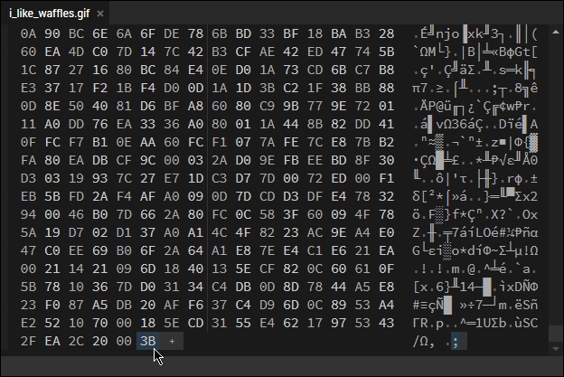
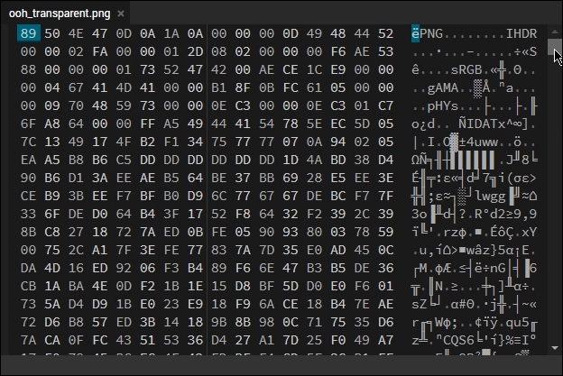
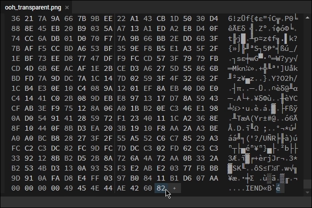

## 与背景一体的艺术展柜图片制作方法

[具体效果](./Profile-Beautify.md#艺术作品展柜-及-精美艺术作品展柜)

### 通过网站直接下载切割好的背景

- 打开 [steam.design](https://steam.design/) 选择喜欢的壁纸直接下载切割好的图片，可以登录获取你 `Steam 库存` 内已拥有的背景

### 通过图片模板手动切割背景

- 如果您使用的是普通的 `艺术作品展柜`（即1个中间和1个侧面的图片）;对于中间图稿，宽度应为 506 像素宽和任意高度。然后，侧面图稿应为 100 像素，并且如果希望它对齐，则其高度应与中间相同。

- 如果您使用的是 `精美艺术作品展柜`，这只是一个大的中间艺术作品，那么它需要是630像素宽和任何高度。

- [[教程]用模板对长展柜进行切割与上传](https://keylol.com/t213192-1-1)

## 如何制作透明的展柜图片

[将透明图像上传到 Steam (Upload Transparent Images to Steam)](https://steamcommunity.com/sharedfiles/filedetails/?id=2175748848)
Written by [David Macintosh](https://steamcommunity.com/id/davidfigaromacintosh/)

如果您不是Steam的创建者，请不要将任何内容上传到Steam，没有版权，也没有上传权限！

确保您已同意创意工坊法律协议，否则您将无法上传创意工坊：

[Steam 订户协议(STEAM®用户协议)](http://steamcommunity.com/sharedfiles/workshoplegalagreement)

[Steam 规则及指引：讨论、评测以及用户生成内容](https://help.steampowered.com/zh-cn/faqs/view/6862-8119-C23E-EA7B)

### 修改图像数据 （GIF/JPEG）

如果您要上传为透明的 GIF，请按照以下步骤操作。

- 访问此站点：<https://hexed.it>
- 单击 `打开文件` 并加载所需的图像：
- 滚动到页面的最底部：
- 将文件的最后一个字节替换为 ``21`` 或 ``2C`` ：
- 单击 `导出` 并保存修改后的图像：
- 对其余四个图像重复此步骤。





### 修改图像数据 （PNG/APNG）

上一节中描述的方法也可以应用于 `PNG` 图像。
但是，在包括 `Firefox` 在内的一些 `web 浏览器` 中，图像将无法正确显示。
此修复允许您避免此问题

这个技巧会将文件大小增加 `1字节`。
但这是一个非常小的数额，所以你不必太在意它。

如果您要上传为透明的 PNG，请按照以下步骤操作。

- 访问此站点：<https://hexed.it>
- 单击 `打开文件` 并加载所需的图像：
- 滚动到页面的最底部：
- 复制以下字节序列。

```:no-line-numbers
01 49 45 4E 44 00 D1 1A 4F E1
```

- 从末尾选择第一个"00"字节跟踪，然后按 Ctrl+V。
选择"覆盖光标位置的字节"和"十六进制值"选项
，然后单击"应用"按钮。
- 单击 `导出` 并保存修改后的图像：
- 对其余四个图像重复此步骤。






