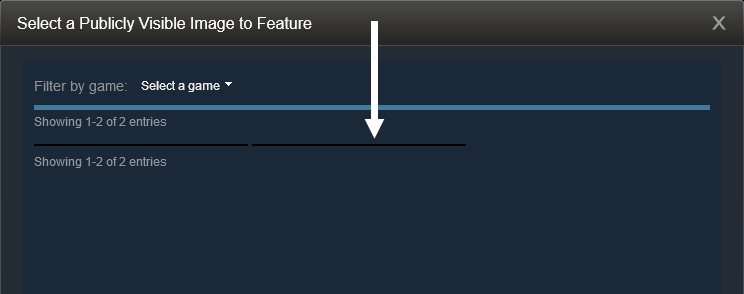
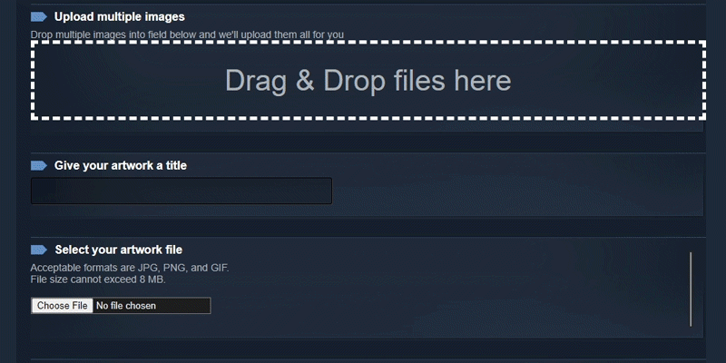

## 如何上传

- 先打开上传的网址 比如:
  
  <https://steamcommunity.com/sharedfiles/edititem/767/3/>
  <https://steamcommunity.com/workshop/edititem/570/11>

- 在 `选择文件` 下选择您的图片。

- 右键单击页面上的任意位置，单击检查/检查元素，然后转到"控制台"。或者使用快捷方式打开,一般浏览器默认为 ``F12`` `Ctrl+Shift+J` `Ctrl+Shift+K`
  >Firefox（只需要做一次）：打开控制台后，手动输入"允许粘贴"，不带引号，然后将其删除（无需按 `Enter` 键）。默认情况下，Firefox不允许您将代码粘贴到控制台中，这将禁用它。

- 将这些代码之一粘贴到控制台中，然后按回车键。只需要使用其中一个可用的代码，而不是同时多个代码。

- 现在只需给它一个标题，然后勾选 `我保证此艺术作品是我创作的`，然后 `保存并继续`。

- 有标题上传

    即在个人资料先在上面显示标题然后才是上传的图片

- 无标题上传

    不显示标题直接显示图片的上传方式

**重要说明**：在图稿选择器上，上传的图片将显示为一条细黑线。这完全没问题，这意味着代码可以正常工作，当你选择图稿时，加载后它应该看起来正常。



## 上传为 `艺术作品 Artwork` 或 `精美艺术作品 Featured Artwork`

::: details 点击查看上传方法

1. 使用浏览器（Chrome、Firefox 等）打开此链接：

    <https://steamcommunity.com/sharedfiles/edititem/767/3/>

2. 为**艺术作品**指定标题，然后选择透明图像作为艺术作品文件。

3. 按 `F12` 打开开发人员控制台。

4. 单击"控制台"选项卡，粘贴以下代码：

    <CodeGroup>

    <CodeGroupItem title="有标题的上传">

    ```JavaScript:no-line-numbers
    $J（'#image_width'）.val（1000），$J（'#image_height'）.val（1）;
    ```

    </CodeGroupItem>

    <CodeGroupItem title="有标题的上传2">

    ```JavaScript:no-line-numbers
    var num= document.getElementsByName("image_width")[0].value;
    document.getElementsByName("image_height")[0].value = num-(num-1);
    document.getElementsByName("image_width")[0].value= num*100;
    ```

    </CodeGroupItem>

    <CodeGroupItem title="无标题的上传(标题框留空)">

    ```JavaScript:no-line-numbers
    function SubmitItem( bOverrideAppID ){$('SubmitItemForm').submit();}
    ```

    </CodeGroupItem>

    </CodeGroup>

5. 按 `Enter` 键应用代码。

6. 勾选 `我保证此艺术作品是我创作的` 复选框。

7. 单击 `保存并继续` 按钮以上传您的作品。

:::

## 上传为 `创意工坊 Workshop`

::: details 点击查看上传方法

1. 使用浏览器（Chrome、Firefox 等）打开此链接：

    <https://steamcommunity.com/sharedfiles/edititem/767/3/>

    <https://steamcommunity.com/workshop/edititem/570/11>

2. 为您的**创意工坊**指定一个标题，然后选择透明图片作为插图文件。

3. 按 `F12` 打开开发人员控制台。

4. 单击"控制台"选项卡，粘贴以下其中一条代码：

    <CodeGroup>
    <CodeGroupItem title="有标题的上传1" active>

    ```JavaScript:no-line-numbers
    $J（'[name=consumer_app_id]'）.val（480），$J（'[name=file_type]'）.val（0），$J（'[name=visibility]'）.val（0）;
    ```

    ```JavaScript:no-line-numbers
    $J('#ConsumerAppID').val(480),$J('[name=file_type]').val(0),$J('[name=visibility]').val(0);
    ```

    </CodeGroupItem>

    <CodeGroupItem title="有标题的上传2">

    ```JavaScript:no-line-numbers
    $J（'#image_width'）.val（'1000'）;$J（'#image_height'）.val（'1'）;$J（'[name="appid"]'）.val（"480"）;$J（'[name="consumer_app_id"]'）.val（"480"）;$J（'[name="visibility"]'）.val（"0"）;$J（'[name=file_type]'）.val（'11'）;
    ```

    ```JavaScript:no-line-numbers
    $J('#image_width').val('1000');$J('#image_height').val('1');$J('[name="appid"]').val("766");$J('[name="consumer_app_id"]').val("766");$J('[name="visibility"]').val("0");$J('[name=file_type]').val('11');
    ```

    </CodeGroupItem>

    <CodeGroupItem title="无标题的上传(标题框留空)">

    ```JavaScript:no-line-numbers
    function SubmitCollection(){$('SubmitCollectionForm').submit();}
    ```

    </CodeGroupItem>

    </CodeGroup>

5. 按 `Enter` 键应用代码。

6. 勾选 `我保证此艺术作品是我创作的` 复选框。

7. 点击 `保存并继续` 按钮上传您的创意工坊。

:::

## 上传为 `屏幕截图 Screenshot`

::: details 点击查看上传方法

1. 使用浏览器（Chrome、Firefox 等）打开此链接：

    <https://steamcommunity.com/sharedfiles/edititem/767/3/>

2. 为**屏幕截图**指定标题，然后选择透明图像作为插图文件。

3. 按 `F12` 打开开发人员控制台。

4. 单击"控制台"选项卡，粘贴以下代码：

    <CodeGroup>

    <CodeGroupItem title="有标题的上传">

    ```JavaScript:no-line-numbers
    $J（'#image_width'）.val（1000），$J（'#image_height'）.val（1），$J（'[name=file_type]'）.val（5）;
    ```

    </CodeGroupItem>

    <CodeGroupItem title="无标题的上传(标题框留空)">

    ```JavaScript:no-line-numbers
    function SubmitItem( bOverrideAppID ){$('SubmitItemForm').submit();}
    ```

    </CodeGroupItem>

    </CodeGroup>

5. 按 `Enter` 键应用代码。

6. 勾选 `我保证此艺术作品是我创作的` 复选框。

7. 单击 `保存并继续` 按钮以上传屏幕截图。

:::

## 上传为 `指南 Guide`

::: details 点击查看上传方法

1. 打开此链接：

    <https://steamcommunity.com/sharedfiles/editguide/?appid=480>

2. 为**指南**指定标题，然后选择透明图像作为品牌图像。

3. 勾选`我是本指南的原创者，或有本指南原创者的法律授权以发表指南。`复选框。

4. 单击 `保存并继续` 按钮以上传您的指南。

    <CodeGroup>

    <CodeGroupItem title="有标题的上传1">

    ```JavaScript:no-line-numbers
    $J（'[name=consumer_app_id]'）.val（480）;$J（'[name=file_type]'）.val（9）;$J（'[name=visibility]'）.val（0）;
    ```

    </CodeGroupItem>

    <CodeGroupItem title="有标题的上传2">

    ```JavaScript:no-line-numbers
    $J（'#image_width'）.val（'1000'）;$J（'#image_height'）.val（'1'）;;$J（'[name="appid"]'）.val（"760"）;$J（'[name="consumer_app_id"]'）.val（"760"）;$J（'[name="visibility"]'）.val（"0"）;$J（'[name=file_type]'）.val（'9'）;
    ```

    </CodeGroupItem>

    <CodeGroupItem title="无标题的上传(标题框留空)">

    ```JavaScript:no-line-numbers
    function SubmitGuide(){$('SubmitGuideForm').submit();}
    ```

    </CodeGroupItem>

    </CodeGroup>

:::

## 通过浏览器扩展上传

[Steam.Design](https://steam.design/) 的团队创建了一个浏览器 扩展/插件，可以自动上传各种类型的艺术作品创作！

[](https://chrome.google.com/webstore/detail/steamdesign-buttons/mjmabgdoainclinjecbkdancpamdiaih/related)
[](https://addons.mozilla.org/en-US/firefox/addon/steam-design-buttons/)

使用扩展程序上传时，它具有一个框，您可以直接拖动 `Gif` 图片，然后单击单个按钮并上传所有内容，不需要粘贴代码就能直接上传。



::: danger 注意

扩展现在有问题，偶尔有效，也会提示错误。如果使用该扩展程序并看到错误，请检查它是否已上传。

:::
