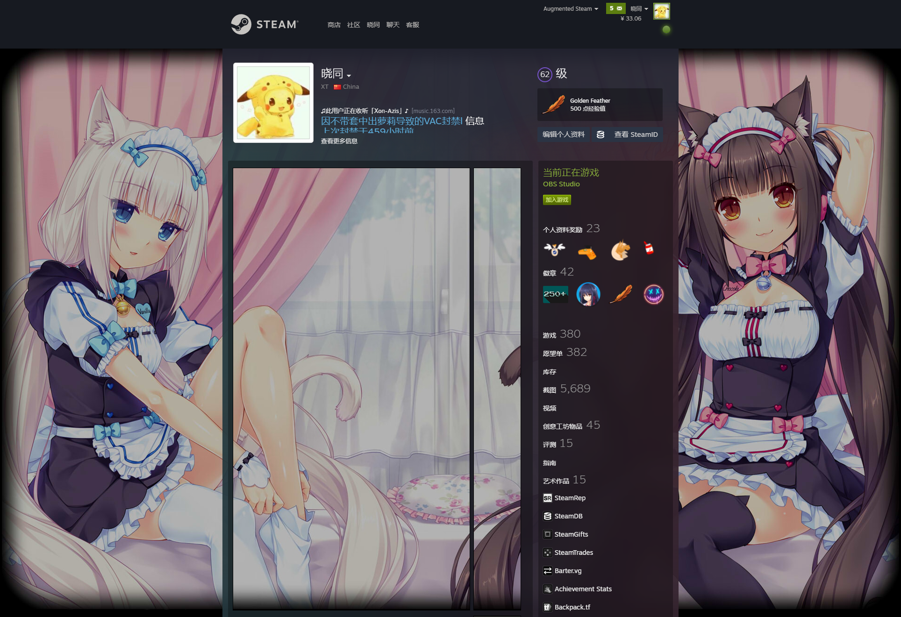
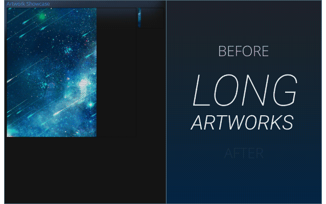
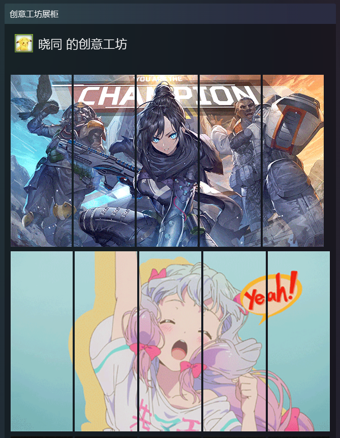

<!-- Profile-Beautify -->

## 选择并自定义在您的个人资料页面上显示的展柜

::: tip
您必须在 `Steam 上达到 10 级` 或在 `点数商店购买` 才能使用展柜功能
:::

## 美化展示

[我的 Steam 美化展示 🎮](https://steamcommunity.com/id/XTxiaotong)

## 艺术作品展柜 及 精美艺术作品展柜

一般都会选择将 `艺术作品展柜 Artwork` 或 `精美艺术作品展柜 Featured Artwork` 放置于第一个使点开链接能看到一张完整的背景，甚至可以选择合成一个喜欢的角色进入背景

以[我的个人资料](https://steamcommunity.com/id/XTxiaotong)示例：

由MightyG3发现这个漏洞，它完全改变了蒸汽配置文件艺术作品。

艺术作品相比精美艺术作品多了一条分割线,如果只放一个作品会留空一部分空间没有图

>上面是艺术作品，下面是精美艺术作品，精美艺术作品一样可以长图，不要被我的图误导

## 创意工坊展柜

创意工坊展柜一般是把一张图切成5份按顺序排列，使得看起来是一整张图

